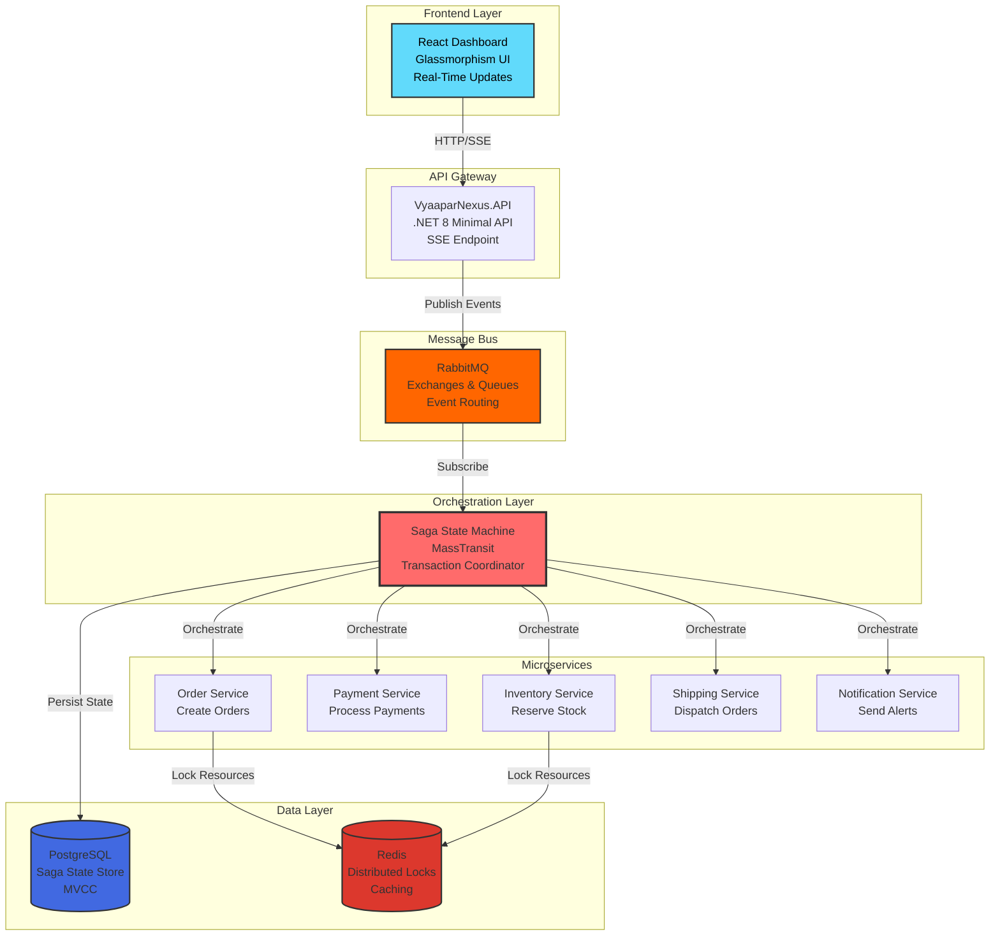

# 🚀 VyaaparNexus: Enterprise-Grade Distributed E-Commerce Orchestrator

<div align="center">


**A production-grade microservices architecture demonstrating distributed system patterns, event-driven orchestration, and real-time observability**

[Live Demo](https://vyaapar-nexus.vercel.app) • [Architecture](#-architecture) • [Features](#-features) • [Tech Stack](#-tech-stack)

</div>

---

## 📋 Table of Contents

- [Overview](#-overview)
- [Key Features](#-key-features)
- [Architecture](#-architecture)
- [Tech Stack](#-tech-stack)
- [System Observability Dashboard](#-system-observability-dashboard)
- [Distributed Patterns Implemented](#-distributed-patterns-implemented)
- [Getting Started](#-getting-started)
- [Project Structure](#-project-structure)
- [Roadmap](#-roadmap)
- [What Makes This Project Stand Out](#-what-makes-this-project-stand-out)

---

## 🎯 Overview

**VyaaparNexus** (व्यापार = Business in Hindi) is a sophisticated distributed e-commerce system built to showcase **enterprise-grade microservices architecture** and advanced distributed system patterns. This project goes beyond typical CRUD applications to demonstrate real-world challenges in building resilient, scalable, and observable distributed systems.

### 💡 The Problem It Solves

Traditional monolithic e-commerce systems fail under high load and struggle with:
- **Transaction Consistency** across multiple services (Order → Inventory → Payment → Shipping)
- **System Resilience** when services fail or become unavailable
- **Real-time Observability** to detect and diagnose issues before they cascade
- **Horizontal Scalability** to handle traffic spikes without downtime

VyaaparNexus addresses these challenges using:
- ✅ **Saga Pattern** for distributed transaction management without 2PC
- ✅ **Event-Driven Architecture** for loose coupling and independent scalability
- ✅ **Real-Time Monitoring** with live service mesh visualization
- ✅ **Chaos Engineering** simulation to test system resilience

---

## ✨ Key Features

### 🎭 **Saga Orchestration**
- **Distributed Transaction Management**: Coordinates multi-step business processes across Order, Payment, Inventory, Notification, and Shipping services
- **Compensating Transactions**: Automatic rollback with compensating actions when any step fails
- **State Machine Implementation**: Robust state transitions with MassTransit State Machine
- **Optimistic Concurrency**: Row-level versioning with EF Core to prevent race conditions

### 🔄 **Event-Driven Microservices**
- **RabbitMQ Message Bus**: Asynchronous, reliable message delivery with publisher confirms
- **Event Sourcing Ready**: All state changes tracked as events
- **Domain Events**: `OrderSubmitted`, `PaymentProcessed`, `InventoryReserved`, `ShippingDispatched`
- **Consumer Groups**: Parallel processing with automatic load balancing

### 📊 **Real-Time System Observability**
- **Live Service Mesh Visualization**: Interactive topology showing service health and throughput
- **Real-Time Metrics Dashboard**:
  - Orders/sec with trend indicators
  - Active Sagas (in-flight transactions)
  - Dead Letter Queue monitoring
- **Streaming Logs**: Server-Sent Events (SSE) for live log tailing
- **Chaos Mode**: One-click chaos injection to simulate system degradation

### 🎨 **Modern Glassmorphism UI**
- **Responsive Design**: Mobile-first approach with collapsible sidebar
- **Theme Modes**: Dark mode (default) and Light mode with optimized contrast
- **Chaos Visualization**: Dynamic background effects with floating particles during chaos simulation
- **Custom Scrollbars**: Theme-aware scrollbars (cyan in normal mode, red in chaos mode)

---

## 🏗️ Architecture

### High-Level Architecture Diagram



### Saga State Machine Flow

```
[Order Submitted] 
    ↓
[Reserve Inventory] ──Failed──> [Release Inventory] ──> [Order Cancelled]
    ↓ Success
[Process Payment] ──Failed──> [Release Inventory] ──> [Order Cancelled]
    ↓ Success
[Send Notification]
    ↓
[Dispatch Shipping] ──Failed──> [Refund Payment] ──> [Order Cancelled]
    ↓ Success
[Order Completed] ✅
```

---

## 🛠️ Tech Stack

### Backend
- **Runtime**: .NET 8.0 (LTS) with Minimal Hosting Model
- **Orchestration**: MassTransit 8.1.3 (Saga State Machine, Outbox Pattern)
- **Message Broker**: RabbitMQ 3.13 (AMQP 0-9-1)
- **Database**: PostgreSQL 16 (MVCC, Row Versioning)
- **Cache & Locks**: Redis 7.2 (Alpine)
- **ORM**: Entity Framework Core 8.0

### Frontend
- **Framework**: React 18.3 with Vite 6.0
- **State Management**: React Hooks (useState, useEffect)
- **Real-Time**: EventSource API (Server-Sent Events)
- **Styling**: TailwindCSS 3.4 (Custom Glassmorphism)
- **Charts**: Recharts 2.15 (Real-time sparklines)
- **Icons**: Lucide React

### DevOps & Tooling
- **Containerization**: Docker & Docker Compose
- **Deployment**: Vercel (Frontend), Render/Fly.io (Backend - Planned)
- **CI/CD**: GitHub Actions (Planned)
- **Monitoring**: Custom Dashboard (Built-in)

---

## 📊 System Observability Dashboard

### Dashboard Features

<table>
<tr>
<td width="50%">

#### 🎯 Metric Cards
- **Orders/sec**: Real-time throughput with trend indicators (↑ ↓ →)
- **Active Sagas**: Count of in-flight distributed transactions
- **Dead Letters**: Failed messages requiring manual intervention
- **Sparkline Graphs**: Last 20 data points showing historical trends

</td>
<td width="50%">

#### 🕸️ Service Mesh
- **Live Topology**: Visual representation of service connectivity
- **Health Indicators**: Per-service health percentage (0-100%)
- **Core Service**: Central CORE node orchestrating satellite services
- **Connection Lines**: Animated data flow visualization

</td>
</tr>
<tr>
<td width="50%">

#### 📜 System Logs
- **Real-Time Streaming**: SSE-powered live log tailing
- **Log Levels**: INFO (blue), WARN (yellow), ERROR (red)
- **Auto-Scroll**: Smart scrolling that pauses when user scrolls up
- **Filtering**: Searchable log entries (Planned)

</td>
<td width="50%">

#### ⚡ Chaos Engineering
- **One-Click Simulation**: SIMULATE CHAOS button
- **Visual Effects**: Background gradients shift to red/orange
- **System Degradation**: Status changes from OPERATIONAL → CRITICAL
- **Glassmorphism**: Enhanced glass effects during chaos mode

</td>
</tr>
</table>

### Screenshots

#### Normal Mode (Operational)

*Dark mode with cyan accents - System running smoothly at 14 days uptime*

#### Light Mode

*Light mode with high contrast for daytime usage*

#### Chaos Mode Active

*Chaos simulation active - Red/orange gradients indicate system stress*

#### Mobile Responsive

*Collapsible sidebar with hamburger menu - Full functionality on mobile*

---

## 🎯 Distributed Patterns Implemented

### 1. **Saga Pattern (Orchestration)**
**Problem**: How do you maintain data consistency across multiple services without distributed transactions (2PC)?

**Solution**: Saga State Machine that coordinates a sequence of local transactions. If any step fails, compensating transactions undo previous work.

```csharp
public class OrderStateMachine : MassTransitStateMachine<OrderState>
{
    public State InventoryReserved { get; private set; }
    public State PaymentProcessed { get; private set; }
    public State OrderCompleted { get; private set; }
    public State OrderCancelled { get; private set; }
    
    public Event<OrderSubmitted> OrderSubmitted { get; private set; }
    public Event<InventoryReserved> InventoryReserved { get; private set; }
    public Event<PaymentProcessed> PaymentProcessed { get; private set; }
    // ... compensating events
}
```

**Business Value**: 
- ✅ Ensures eventual consistency without locking databases
- ✅ Automatic rollback with compensating transactions
- ✅ Clear audit trail of transaction history

---

### 2. **Event-Driven Architecture**
**Problem**: How do you decouple services so they can scale independently?

**Solution**: Services communicate through domain events published to RabbitMQ. Each service subscribes only to events it cares about.

```
Order Service ──[OrderSubmitted]──> RabbitMQ ──> Inventory Service
                                              ──> Payment Service
                                              ──> Notification Service
```

**Business Value**:
- ✅ Services can be deployed independently
- ✅ New services can be added without modifying existing ones
- ✅ Natural async processing for better throughput

---

### 3. **Optimistic Concurrency Control**
**Problem**: How do you prevent race conditions when multiple processes update the same record?

**Solution**: Entity Framework Row Versioning with `[Timestamp]` attribute. Updates fail if the row was modified since it was read.

```csharp
public class OrderState : SagaStateMachineInstance
{
    public Guid CorrelationId { get; set; }
    public string CurrentState { get; set; }
    
    [Timestamp]  // ← PostgreSQL xmin column
    public byte[] RowVersion { get; set; }
}
```

**Business Value**:
- ✅ Prevents lost updates in concurrent environments
- ✅ No pessimistic locking (better performance)
- ✅ Natural fit for event sourcing patterns

---

### 4. **Distributed Locking (RedLock)**
**Problem**: How do you prevent double-processing of business operations (e.g., overselling inventory)?

**Solution**: Redis-based distributed locks ensure only one process can execute critical sections.

```csharp
using (var redLock = await redLockFactory.CreateLockAsync("inventory:item-123", TimeSpan.FromSeconds(10)))
{
    if (redLock.IsAcquired)
    {
        // Reserve inventory - guaranteed single execution
    }
}
```

**Business Value**:
- ✅ Prevents overselling in high-concurrency scenarios
- ✅ Fault-tolerant with automatic lock expiry
- ✅ Works across multiple server instances

---

### 5. **Circuit Breaker (Planned)**
**Problem**: How do you prevent cascading failures when a downstream service is unavailable?

**Solution**: Polly circuit breaker that stops calling a failing service temporarily, giving it time to recover.

**Status**: 🚧 Planned for Phase 2

---

### 6. **Outbox Pattern (Planned)**
**Problem**: How do you ensure messages are published only if database transactions succeed?

**Solution**: MassTransit Outbox stores messages in the same transaction as business data, then publishes them reliably.

**Status**: 🚧 Planned for Phase 2

---

## 🚀 Getting Started

### Prerequisites
- **.NET 8.0 SDK** ([Download](https://dotnet.microsoft.com/download/dotnet/8.0))
- **Docker Desktop** ([Download](https://www.docker.com/products/docker-desktop))
- **Node.js 20+** ([Download](https://nodejs.org/))

### Quick Start (5 minutes)

#### 1️⃣ Clone the Repository
```bash
git clone https://github.com/yourusername/vyaapar-nexus.git
cd vyaapar-nexus
```

#### 2️⃣ Start Infrastructure (RabbitMQ, PostgreSQL, Redis)
```bash
docker-compose up -d
```

#### 3️⃣ Run Backend Services
```bash
# Terminal 1: API
cd src/VyaaparNexus.Api
dotnet run

# Terminal 2: Worker (Saga State Machine)
cd src/VyaaparNexus.Worker
dotnet run
```

#### 4️⃣ Run Frontend Dashboard
```bash
cd client
npm install
npm run dev
```

#### 5️⃣ Open Dashboard
Navigate to **http://localhost:5173**

🎉 You should see the System Observability dashboard with live metrics!

---

### Accessing Services

| Service | URL | Credentials |
|---------|-----|------------|
| **Dashboard** | http://localhost:5173 | - |
| **API** | http://localhost:5001 | - |
| **Swagger** | http://localhost:5001/swagger | - |
| **RabbitMQ UI** | http://localhost:15672 | guest / guest |
| **PostgreSQL** | localhost:5432 | postgres / postgres |
| **Redis** | localhost:6379 | - |

---

## 📁 Project Structure

```
vyaapar-nexus/
├── client/                          # React Frontend
│   ├── src/
│   │   ├── components/
│   │   │   ├── Header.jsx          # Top navigation with SIMULATE CHAOS
│   │   │   ├── Sidebar.jsx         # Navigation sidebar (collapsible on mobile)
│   │   │   ├── MetricCard.jsx      # Orders/sec, Active Sagas, Dead Letters
│   │   │   ├── ServiceMesh.jsx     # Live topology visualization
│   │   │   └── LogTerminal.jsx     # Real-time log streaming
│   │   ├── hooks/
│   │   │   └── useSystemStream.js  # SSE connection hook
│   │   ├── App.jsx                 # Main layout with glassmorphism
│   │   └── App.css                 # Custom glassmorphism & scrollbar styles
│   ├── package.json
│   └── vite.config.js
│
├── src/
│   ├── VyaaparNexus.Api/           # ASP.NET Core Minimal API
│   │   ├── Program.cs              # Entry point, MassTransit configuration
│   │   ├── appsettings.json        # Configuration (RabbitMQ, PostgreSQL)
│   │   └── VyaaparNexus.Api.csproj
│   │
│   ├── VyaaparNexus.Worker/        # Background Worker (Saga Host)
│   │   ├── Program.cs              # Saga State Machine registration
│   │   ├── OrderCreatedConsumer.cs # Event consumer
│   │   └── VyaaparNexus.Worker.csproj
│   │
│   └── VyaaparNexus.Contracts/     # Shared message contracts
│       ├── OrderSubmitted.cs       # Domain events
│       └── VyaaparNexus.Contracts.csproj
│
├── docker-compose.yml              # Infrastructure (RabbitMQ, PostgreSQL, Redis)
├── VyaaparNexus.sln                # Solution file
└── README.md                       # This file
```

---

## 🗺️ Roadmap

### ✅ Phase 1: Foundation (Current)
- [x] Microservices architecture with .NET 8
- [x] MassTransit Saga State Machine setup
- [x] RabbitMQ message bus integration
- [x] PostgreSQL state persistence
- [x] Real-time observability dashboard
- [x] Glassmorphism UI with chaos mode
- [x] Mobile responsive design
- [x] Docker Compose for local development

### 🚧 Phase 2: Production Readiness (In Progress)
- [ ] **Saga Implementation**: Complete order fulfillment workflow
- [ ] **Compensating Transactions**: Automatic rollback logic
- [ ] **Outbox Pattern**: Reliable message publishing
- [ ] **Circuit Breaker**: Resilience with Polly
- [ ] **Distributed Tracing**: OpenTelemetry integration
- [ ] **API Rate Limiting**: YARP with Redis sliding window
- [ ] **Health Checks**: Kubernetes-ready endpoints

### 🔮 Phase 3: Advanced Features
- [ ] **Event Sourcing**: Complete event store
- [ ] **CQRS**: Separate read/write models
- [ ] **GraphQL API**: Flexible querying with HotChocolate
- [ ] **WebSockets**: Bi-directional real-time updates
- [ ] **Multi-Tenancy**: Tenant isolation with separate databases
- [ ] **Kubernetes Deployment**: Helm charts for production
- [ ] **Prometheus Metrics**: Custom metrics exporter
- [ ] **Grafana Dashboards**: Production monitoring

### 🎯 Phase 4: E-Commerce Features
- [ ] **Product Catalog**: Browse and search products
- [ ] **Shopping Cart**: Persistent cart with Redis
- [ ] **User Authentication**: JWT with refresh tokens
- [ ] **Payment Integration**: Stripe/Razorpay
- [ ] **Order History**: Track past orders
- [ ] **Recommendations**: ML-based product suggestions

---

## 🌟 What Makes This Project Stand Out

### For Recruiters & Hiring Managers

This project demonstrates **senior-level engineering capabilities** beyond typical portfolio projects:

#### 1️⃣ **Production-Grade Architecture**
- Not just CRUD operations, but **distributed transaction management**
- Handles **real-world failure scenarios** with compensating transactions
- **Scalable by design** - each service can scale independently

#### 2️⃣ **Modern Technology Stack**
- **.NET 8** (latest LTS) with Minimal APIs
- **MassTransit** - Industry-standard orchestration framework
- **Docker Compose** - Production-like local environment
- **React 18** with modern hooks and real-time updates

#### 3️⃣ **System Design Knowledge**
- **CAP Theorem**: Chooses Availability & Partition Tolerance (AP)
- **Event Sourcing**: All state changes captured as events
- **CQRS-Ready**: Separates command and query concerns
- **12-Factor App**: Follows cloud-native principles

#### 4️⃣ **Observability & Debugging**
- **Real-Time Monitoring**: Built-in observability dashboard
- **Distributed Tracing Ready**: Correlation IDs for request tracking
- **Chaos Engineering**: Proactive failure testing
- **Structured Logging**: Easy to parse and analyze

#### 5️⃣ **Clean Code Practices**
- **SOLID Principles**: Dependency injection, single responsibility
- **Domain-Driven Design**: Bounded contexts per service
- **Vertical Slice Architecture**: Features over layers
- **Testability**: Loosely coupled components

---

## 🎓 Learning Outcomes

Building this project demonstrates proficiency in:

### Backend Skills
✅ Microservices Architecture  
✅ Event-Driven Systems  
✅ Message Queues (RabbitMQ)  
✅ Saga Pattern Implementation  
✅ Distributed Locking (Redis)  
✅ Optimistic Concurrency  
✅ Entity Framework Core  
✅ PostgreSQL with MVCC  
✅ Docker & Containerization  
✅ ASP.NET Core Minimal APIs  

### Frontend Skills
✅ React 18 with Hooks  
✅ Real-Time Updates (SSE)  
✅ Responsive Design (Mobile-First)  
✅ TailwindCSS & Custom Styling  
✅ State Management  
✅ Chart Libraries (Recharts)  
✅ Glassmorphism UI Design  

### System Design Skills
✅ Distributed Transactions  
✅ Eventual Consistency  
✅ Circuit Breaker Pattern  
✅ Outbox Pattern  
✅ Service Mesh Concepts  
✅ Chaos Engineering  
✅ Monitoring & Observability  

---

## 🤝 Contributing

Contributions are welcome! This project is designed for learning and showcasing distributed systems patterns.

### How to Contribute
1. Fork the repository
2. Create a feature branch (`git checkout -b feature/amazing-feature`)
3. Commit your changes (`git commit -m 'Add amazing feature'`)
4. Push to the branch (`git push origin feature/amazing-feature`)
5. Open a Pull Request

### Contribution Ideas
- Implement compensating transaction logic
- Add more microservices (e.g., Fraud Detection, Recommendation Engine)
- Create Kubernetes deployment manifests
- Add integration tests with Testcontainers
- Implement circuit breaker with Polly
- Add distributed tracing with OpenTelemetry

---

## 📖 References & Learning Resources

### Distributed Systems
- [Designing Data-Intensive Applications](https://dataintensive.net/) by Martin Kleppmann
- [Building Microservices](https://www.oreilly.com/library/view/building-microservices-2nd/9781492034018/) by Sam Newman
- [Microsoft - Saga Pattern](https://learn.microsoft.com/en-us/azure/architecture/reference-architectures/saga/saga)

### MassTransit Documentation
- [Saga State Machine](https://masstransit.io/documentation/patterns/saga/state-machine)
- [Outbox Pattern](https://masstransit.io/documentation/patterns/outbox)
- [RabbitMQ Transport](https://masstransit.io/documentation/configuration/transports/rabbitmq)

### Event-Driven Architecture
- [Event Sourcing](https://martinfowler.com/eaaDev/EventSourcing.html) by Martin Fowler
- [Microservices Patterns](https://microservices.io/patterns/index.html) by Chris Richardson

---

## 📧 Contact

**Puneet Prajapat**  
📧 Email: puneetprajapat9326@gmail.com  
💼 LinkedIn: [linkedin.com/in/puneet-prajapat](https://linkedin.com/in/puneet-prajapat)  
🐙 GitHub: [@puneetprajapat](https://github.com/puneetprajapat)  

---

## 📄 License

This project is licensed under the MIT License - see the [LICENSE](LICENSE) file for details.

---

## 🙏 Acknowledgments

- **MassTransit Team** for the excellent orchestration framework
- **Microsoft .NET Team** for .NET 8 improvements
- **RabbitMQ Community** for robust messaging
- **Vercel** for seamless frontend hosting
- **Tailwind CSS** for utility-first styling

---

<div align="center">

### ⭐ If this project helped you learn distributed systems, please star it!

**Built with ❤️ for learning and demonstrating enterprise-grade software engineering**

[⬆ Back to Top](#-vyaaparnexus-enterprise-grade-distributed-e-commerce-orchestrator)

</div>